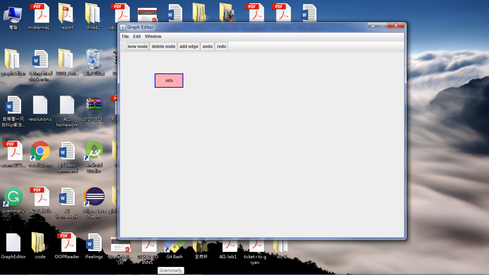
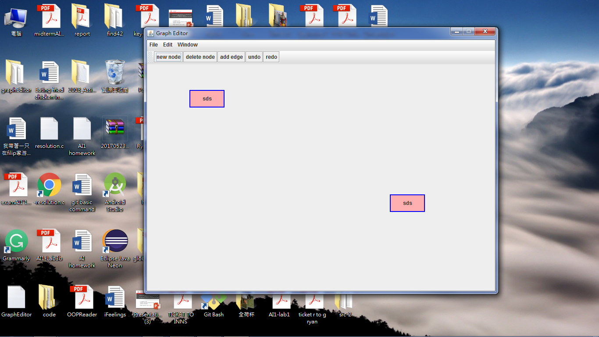
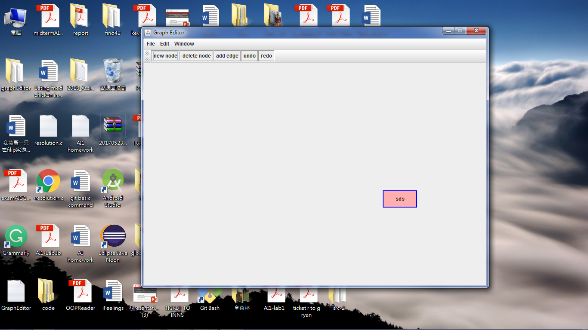

# graphEditor
graphEditor is the final project of OOP at University of Groningen. I finished this project with @BuzzellDeng using git as version controll under MVC model. There are many functions this program providing : 
**This project can let users drag the rectangles in the mainframe.**

before drag

draging-before release mouse

after drag - after release mouse

