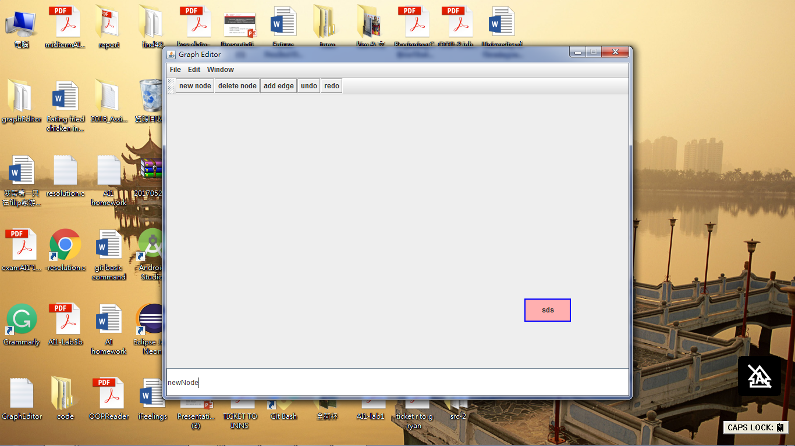
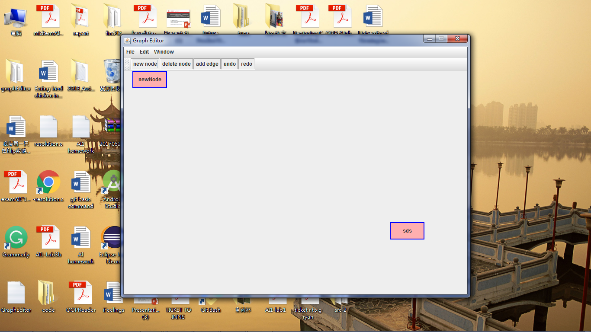
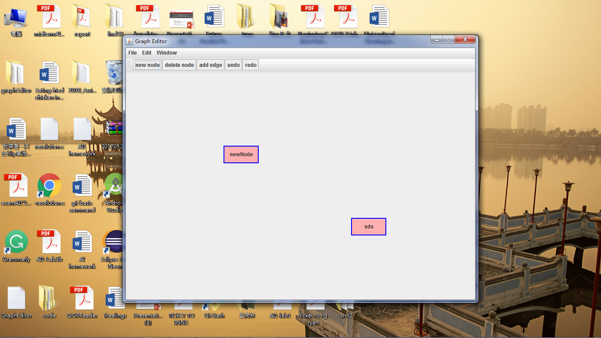

# graphEditor
graphEditor is the final project of OOP at University of Groningen. I finished this project with @BuzzellDeng using git as version controll under MVC model. There are many functions this program providing : 
 
**This project can let users drag the rectangles in the mainframe.**

before dragging

dragging - before releasing mouse

after dragging - after releasing mouse

 
**This project can let users add new nodes on the mainframe.**

before adding

adding - create a name by typing inside the edittext box

after adding 

 
**This project can let users add edges between nodes.**

before adding

adding - create a edge by selecting two nodes 

after adding 

 
**This project can let users delete nodes and the edge with it will automatically disappear.**

before deleting

deleting - selecting the node that want to be deleted

after deleting 

 
**This project can let users store the current state.**
Users can store the current state into data.txt file and when then reopen the program, it will show up the last saved state.

